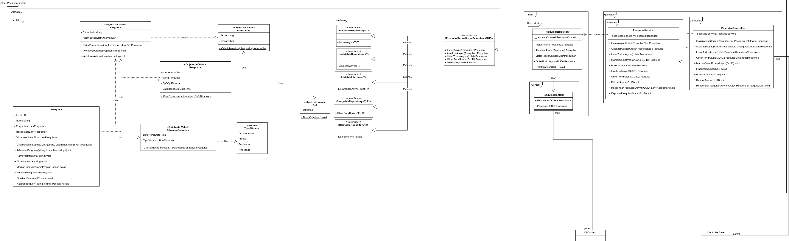
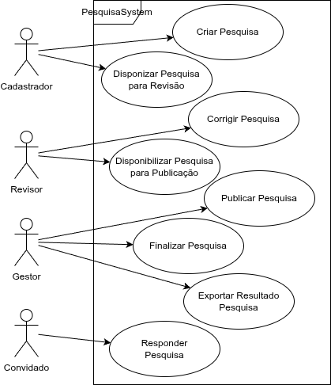
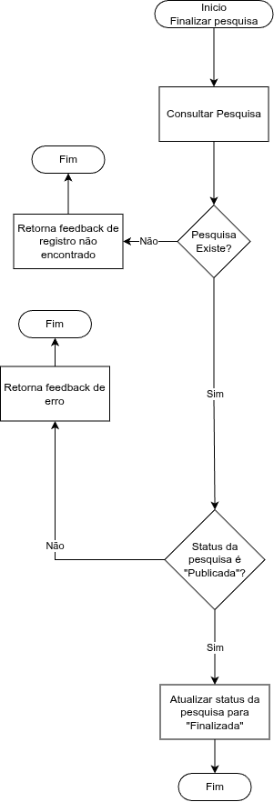
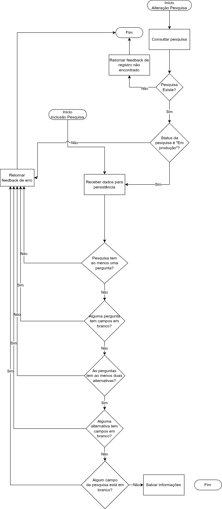
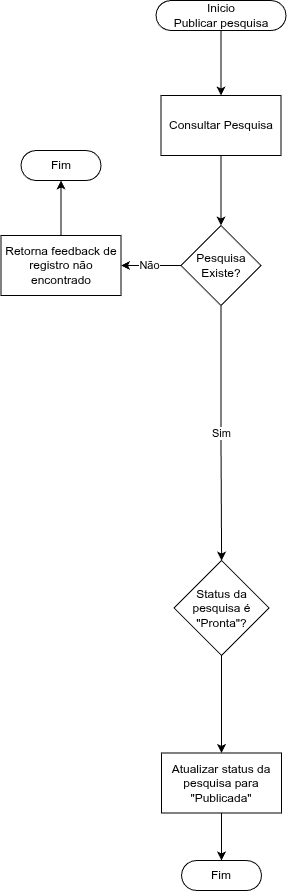
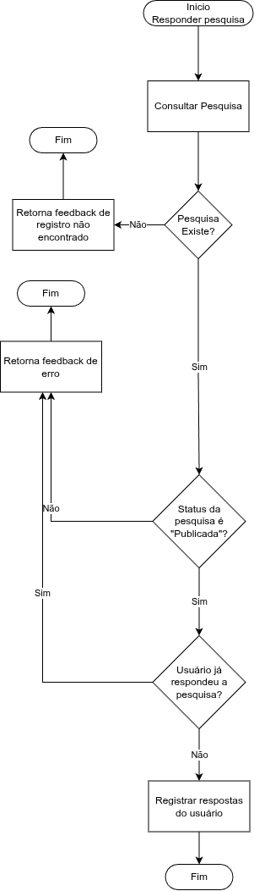

# Classes

O sistema foi separado em camadas, de forma que as responsabilidades sobre cada operação
relativa à criação de uma pesquisa fosse bem dividida, isso permite uma maior modularidade
para possível separação de componentes em microsserviços e adição de novas funcionalidades.

As regras se mantém todas na camada de domínio, para garantir que a entidade 
principal (Pesquisa) sempre nasça num estado válido.

As operações de Publicação e Finalização foram mantidas em operações separadas para manter
mais legibilidade do código devido às validações, além de que são operações que dependem
apenas de um _Id_ como parâmetro externo para serem executadas, já que as situações
são gerenciadas pela própria entidade pesquisa.

# Casos de uso

Foi pensado o seguinte ciclo de vida para a entidade pesquisa

- A pesquisa nasce com o estado "Em Produção"
  - Durante esse estado, a pesquisa pode ser alterada livremente, inclusive ser deletada.
- Após concluída as edições, a pesquisa é publicada
  - A partir deste ponto, a pesquisa não pode mais ser alterada nem apagada
  e a mesma fica disponível para receber respostas
- Findado o tempo de levantamento dos dados, a pesquisa é finalizada
  - Nesse estado a pesquisa não pode mais receber respostas nem ser alterada.

# Fluxos

